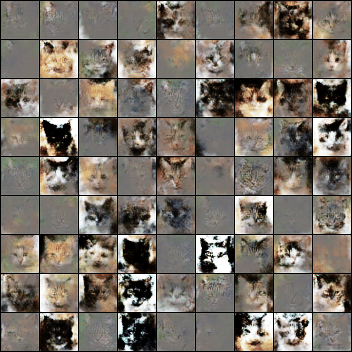

# Deep Convolutional Generative Adversarial Networks

DCGAN (Deep Convolutional Generative Adversarial Networks) is a method that uses convolutional and convolutional-transpose layers in the discriminator and generator, respectively. At the time, it demonstrated that GANs could be trained effectively and were practical for high-quality image generation.

## Installation

```console
git clone https://github.com/bareform/dependencies.git
conda update -n base -c defaults conda
conda env create -f dependencies/environment.yml
conda activate bareform

git clone https://github.com/bareform/dcgan.git
cd dcgan
```

<details>
  <summary> Dependencies (click to expand) </summary>
  
  ## Dependencies
  - Python 3.10
  - datasets
  - numpy
  - torch
  - torchvision
    
</details>

## Quick Start

To train a low-res `AFHQ Cat` DCGAN:

```
python3 -m utils.trainer --config="./configs/afhq_cat.toml"
```

After training for 500 epochs, you can find the following gif at `./assets/afhq-cat/afhq-cat_500.gif`.



Using the configuration provided at `./configs/afhq_cat.toml`, we achieve a mean FID score of 33.93 with a standard deviation of 0.115 over 10 runs.

You can download the pre-trained model [here](https://huggingface.co/luethan2025/dcgan) and use the provided Jupyter Notebook `inference.ipynb` to generate some samples.

## Method

[Unsupervised Representation Learning with Deep Convolutional Generative Adversarial Networks](https://arxiv.org/pdf/1511.06434)

Alec Radford<sup>1</sup>, Luke Metz<sup>1</sup>, Soumith Chintala<sup>2</sup>

<sup>1</sup>indico Research, <sup>2</sup>Facebook AI Research

> In recent years, supervised learning with convolutional networks (CNNs) has seen huge adoption in computer vision applications. Comparatively, unsupervised learning with CNNs has received less attention. In this work we hope to help bridge the gap between the success of CNNs for supervised learning and unsupervised learning. We introduce a class of CNNs called deep convolutional generative adversarial networks (DCGANs), that have certain architectural constraints, and demonstrate that they are a strong candidate for unsupervised learning. Training on various image datasets, we show convincing evidence that our deep convolutional adversarial pair learns a hierarchy of representations from object parts to scenes in both the generator and discriminator. Additionally, we use the learned features for novel tasks - demonstrating their applicability as general image representations.

## Citation

The original paper can be found at:
```
@misc{radford2015dcgan,
    title={Unsupervised Representation Learning with Deep Convolutional Generative Adversarial Networks},
    author={Alec Radford and Luke Metz and Soumith Chintala},
    year={2015},
    eprint={1511.06434},
    archivePrefix={arXiv},
    primaryClass={cs.LG}
}
```
